# 🔗 Processos de Redundância de Arquivos na Azure com API IBGE

Este projeto tem como objetivo demonstrar um processo de redundância de arquivos na Azure, utilizando o Azure Data Factory para extrair dados da API pública do IBGE e armazená-los no Azure Blob Storage.

## 🏗️ Arquitetura da Solução
- **Azure Data Factory**
  - Linked Service REST (Conexão com API IBGE)
  - Linked Service Blob Storage (Armazenamento)
  - Pipeline de cópia de dados
  - Dataset de Origem (API - JSON) *(inline no pipeline)*
  - Dataset de Destino (Blob Storage - JSON) *(inline no pipeline)*

---

## 🛠️ Etapas do Projeto

### 1️⃣ Criação do Linked Service de Origem (API IBGE)
- Configuração da conexão com a API pública do IBGE utilizando o conector **REST**.
- Definição da URL base da API que fornece os dados do **IPCA (Índice de Preços ao Consumidor Amplo)**.
- Este Linked Service será usado no Dataset de origem dentro do pipeline.

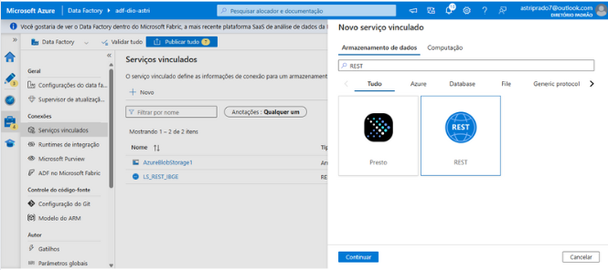

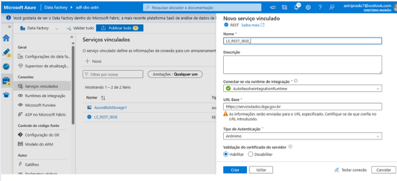

---

### 2️⃣ Criação do Linked Service de Destino (Blob Storage)
- Criação da conexão com o **Azure Blob Storage**, utilizado como repositório para armazenar os dados extraídos da API.
- Configuração do acesso utilizando a Storage Account criada anteriormente.

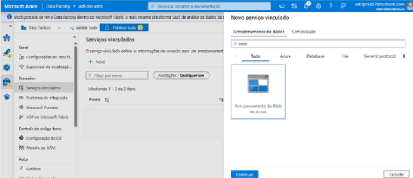

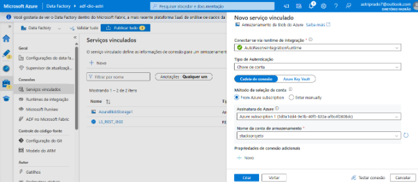

---

### 3️⃣ Criação do Pipeline
- Criação do pipeline no **Azure Data Factory**, responsável por orquestrar o processo de extração e carga dos dados.
- Utilização da atividade **Copy Data**, que será configurada com os datasets de origem e destino.

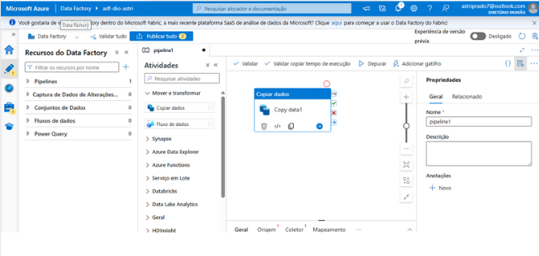

---

### 4️⃣ Criação do Dataset de Origem
- Dataset configurado diretamente dentro da atividade **Copy Data**.
- Conectado ao **Linked Service REST (API IBGE)**, utilizando o endpoint da API que retorna os dados do IPCA dos últimos 12 meses.
- Definido no formato **JSON**.

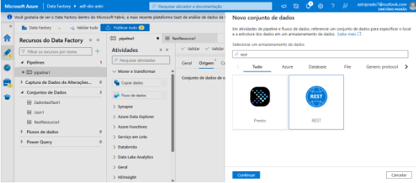

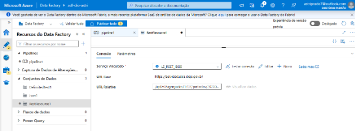

---

### 5️⃣ Criação do Dataset de Destino
- Dataset criado dentro da atividade **Copy Data**.
- Aponta para o **Linked Service do Blob Storage**, definindo:
  - Formato de saída dos dados: **JSON**.
  - Container de armazenamento.

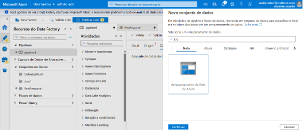

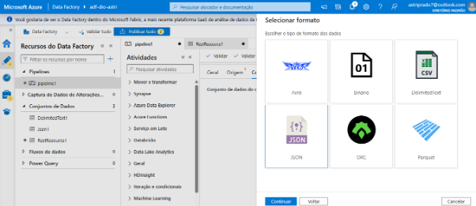

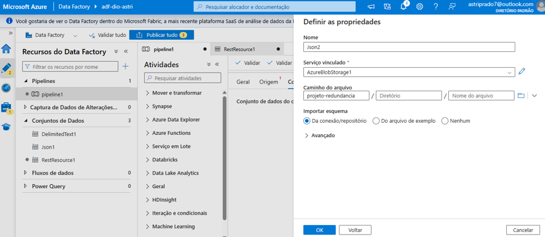
---

### 6️⃣ Execução do Pipeline
- Validação e execução do pipeline no modo **Debug**, seguida de publicação.
- Após a execução, os dados são gravados no Blob Storage no formato JSON.
- Verificação no Blob Storage para confirmar a criação correta dos arquivos e a integridade dos dados.

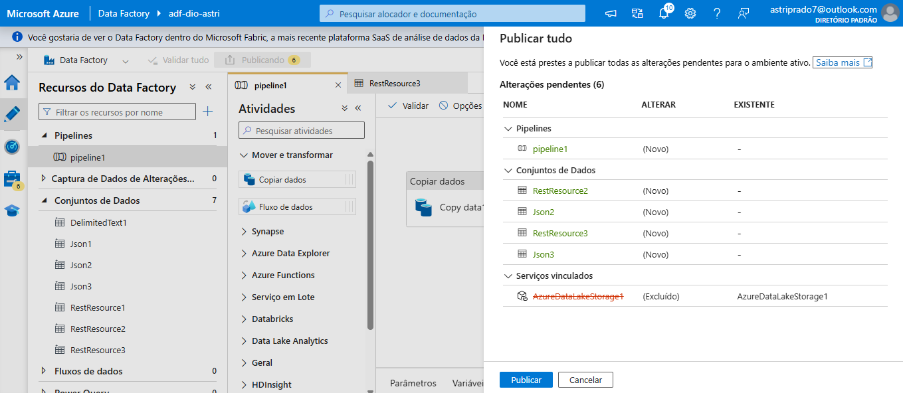

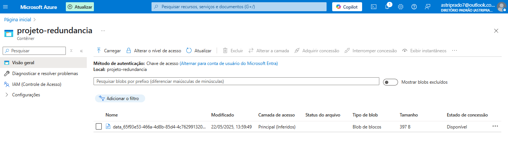
---

## 📄 Resultado
O arquivo JSON gerado contém os dados do IPCA (variação mensal) dos últimos 12 meses, extraídos da API do IBGE e armazenados no Azure Blob Storage, conforme exemplo abaixo:

```json
{
  "id": "63",
  "variavel": "IPCA - Variação mensal",
  "unidade": "%",
  "resultados": [
    {
      "series": [
        {
          "localidade": {
            "id": "1",
            "nivel": {
              "id": "N1",
              "nome": "Brasil"
            },
            "nome": "Brasil"
          },
          "serie": {
            "202305": "0.23",
            "202306": "-0.08",
            "202307": "0.12",
            "202308": "0.23",
            "202309": "0.26",
            "202310": "0.24",
            "202311": "0.28",
            "202312": "0.56",
            "202401": "0.42",
            "202402": "0.83",
            "202403": "0.16",
            "202404": "0.38"
          }
        }
      ]
    }
  ]
}
```

## 🚀 Tecnologias Utilizadas
- Azure Data Factory
- Azure Blob Storage
- API pública do IBGE (IPCA)
- Formato de dados: JSON

---

## ✍️ Autor
Astri Prado
